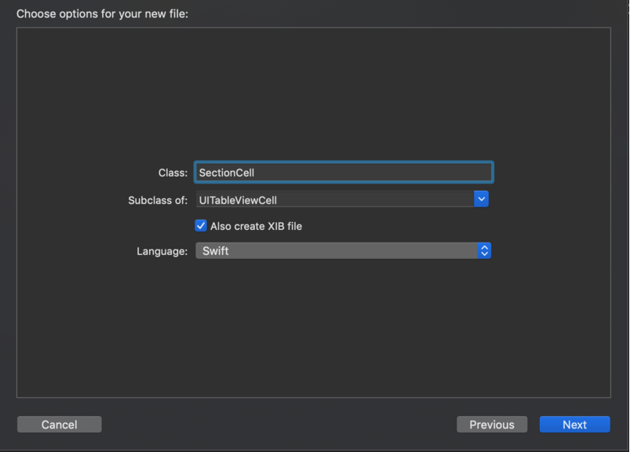

# Accorlex
This is a accordion menu implemented in Swift.

Your app will act like in gif after accorlex implemented.


You can add your table view from IB like this.


Accorlex using cell for section header. You will add two different type cells for a section, one for section header and the other for items.



And you will create model to your cell.

```
public struct SectionCellModel {
    var label: String?
}
```


#### AccorlexConfigurableCell

```
public protocol AccorlexConfigurableCell: NibLoadableView, ReusableView {
    associatedtype DataType
    func configure(data: DataType)
}
```
You will use this protocol with you cells to relate with its data type.

```
public class SectionCell: UITableViewCell, AccorlexConfigurableCell {

    @IBOutlet weak var label: UILabel!

    override public func awakeFromNib() {
        super.awakeFromNib()
    }

    public func configure(data: SectionCellModel) {
        label.text = data.label
    }
}
```


#### AccorlexCellConfigurator

You will create a configurator for your cell using associated types, cell type and its data type.

```
public typealias SectionCellConfig = AccorlexCellConfigurator<SectionCell, SectionCellModel>
```
This configurator will register your cell to AccorlexTableView, relate cell with its data and configure cell.


#### AccorlexSectionConfigurator

This configurator takes sectionCell, sectionCellModel, itemCell and itemCellModel as associated types.

```
public typealias MySectionConfigurator = AccorlexSectionConfigurator<NormalCell, SectionCell, NormalCellModel, SectionCellModel>
```

```
public init(cellItems: Array<CellDataType>, headerItem: HeaderDataType,_ didSelect: ((_ selected: CellDataType) -> ())?,_ didHeaderSelect: ((_ selected: HeaderDataType) -> ())?)
```
Its init function will take itemModel array, sectionHeaderModel and select closures for items and header.


```
let section1Model = SectionCellModel(label: "Birinci Section")
```

```
var section1Cells: [NormalCellModel] = []
for i in (0...5) {
    let section1Cell = NormalCellModel(topLabel: "Birinci Section \(i). cell",
                    bottomLabel: "Deneme", color: colorArray[i % (colorArray.count - 1)])
    section1Cells.append(section1Cell)
}
```

```
let section1 = MySectionConfigurator(cellItems: section1Cells, headerItem: section1Model, {
    selected in
    print(selected)
    }) { headerSelected in
        print(headerSelected.label)
    }
```

#### AccorlexViewModel

This view model takes section array and all of Accorlex Core is binding by this with AccorlexTableView.

```
let accorlexViewModel = AccorlexViewModel(sections: [section1, section2])
accorlexTableView.accorlexViewModel = accorlexViewModel
accorlexTableView.reloadData()
```

And you are ready to run your app!

